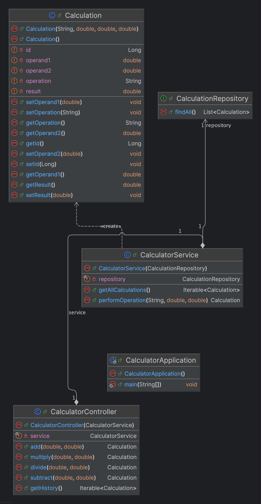

# Calculator Service

A simple calculator service built with Spring Boot, featuring basic arithmetic operations and persistence using JPA and an H2 in-memory database. The service provides RESTFUL endpoints to perform calculations and retrieve the history of operations.

## Features

- **Arithmetic Operations**: Perform addition, subtraction, multiplication, and division.
- **History Tracking**: Retrieve the history of all calculations performed.
- **In-Memory Database**: Uses H2 database for storing calculation history.
- **Spring Boot**: Utilizes Spring Boot for rapid development and ease of use.

## Technologies Used

- **Spring Boot**: Framework for building the RESTFUL service.
- **Spring Data JPA**: Data access layer using JPA.
- **H2 Database**: In-memory database for development and testing.
- **JUnit**: Testing framework for unit tests.

## Class Diagram



## API Endpoints

Example Request for Add:
```bash
curl -X GET "http://localhost:8080/api/calculator/add?a=5&b=3"
```

Example Response:
```bash
{
  "id": 1,
  "operation": "add",
  "operand1": 5,
  "operand2": 3,
  "result": 8
}
```

Example Request for Subtract:
```bash
curl -X GET "http://localhost:8080/api/calculator/subtract?a=5&b=3"
```

Example Response:
```bash
{
  "id": 2,
  "operation": "subtract",
  "operand1": 5,
  "operand2": 3,
  "result": 2
}
```

Example Request for Multiply:
```bash
curl -X GET "http://localhost:8080/api/calculator/multiply?a=5&b=3"
```

Example Response:
```bash
{
  "id": 3,
  "operation": "multiply",
  "operand1": 5,
  "operand2": 3,
  "result": 15
}
```

Example Request for Divide:
```bash
curl -X GET "http://localhost:8080/api/calculator/divide?a=6&b=3"
```

Example Response:
```bash
{
  "id": 4,
  "operation": "divide",
  "operand1": 6,
  "operand2": 3,
  "result": 2
}
```

History:
```bash
curl -X GET "http://localhost:8080/api/calculator/history"
```

Example Response:
```bash
[
  {
    "id": 1,
    "operation": "add",
    "operand1": 5,
    "operand2": 3,
    "result": 8
  },
  {
    "id": 2,
    "operation": "subtract",
    "operand1": 5,
    "operand2": 3,
    "result": 2
  }
  // Additional calculations...
]
```

## Setup and Installation

### Prerequisites

- Java 17
- Maven

### Clone the Repository

```bash
git clone https://github.com/your-username/Calculator.git
cd Calculator
